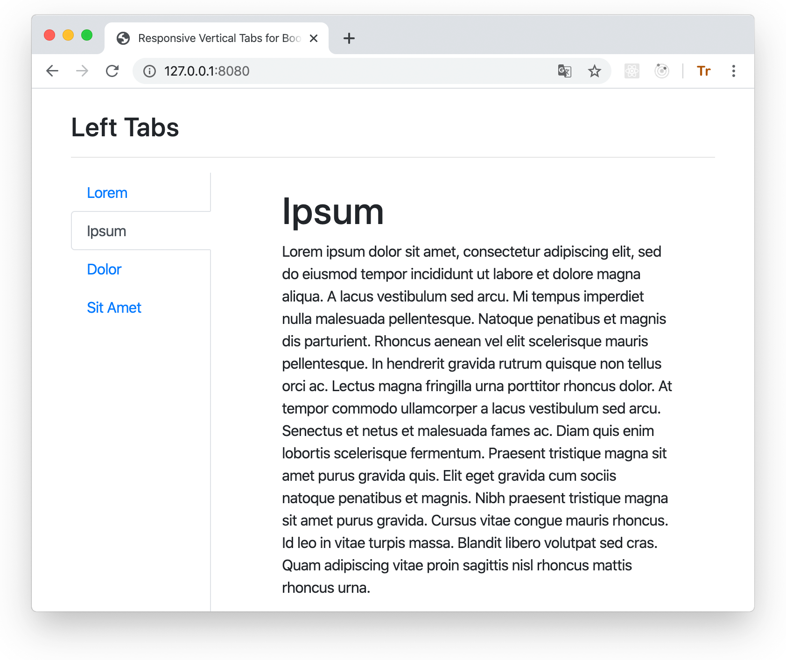
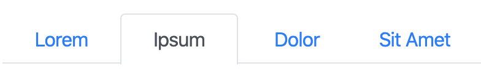
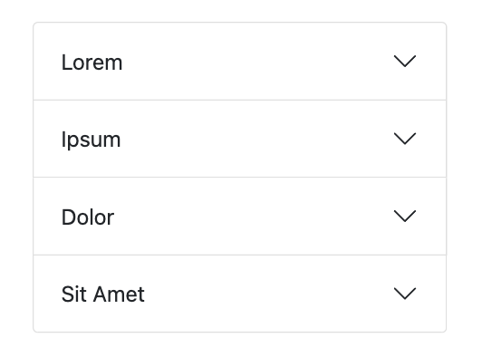
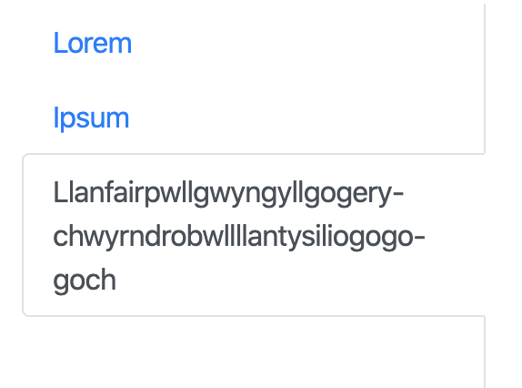
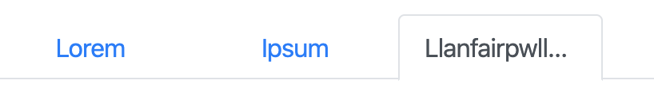
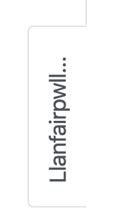
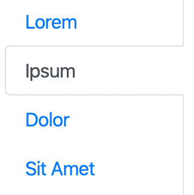
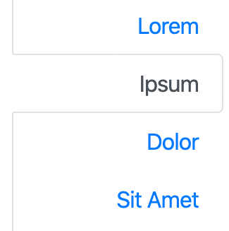
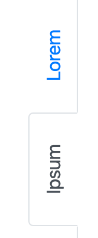
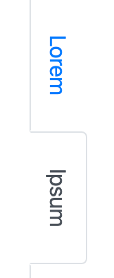

# Responsive Vertical Navigation Tabs for Boostrap 5

[](https://app.travis-ci.com/tromgy/bootstrap-5-vertical-tabs) [](https://app.netlify.com/sites/b5vtabs/deploys)

A stylesheet that implements [vertically-oriented navigation tabs](https://b5vtabs.netlify.com) with Bootstrap 5.



This package is an update for Bootstrap 5 of the [previous](https://github.com/tromgy/bootstrap-4-vertical-tabs) bootstrap vertical tabs package.

## Version 2 changes

Now when the view becames very narrow (e.g. when viewing on a smartphone) the tabs turn into an accordion instead of nav-pill like buttons. This should provide a better mobile experience.

## Installation

This package depends on Bootstrap 5, so it is assumed that you already have it installed and/or included
in your HTML.

You can use this package either by directly embedding its pre-built (in the **dist** folder) stylesheet in your HTML **after the boostrap styles** like this:

```HTML
<link
    rel="stylesheet"
    href="https://cdn.jsdelivr.net/npm/bootstrap-5-vertical-tabs@2.0.0/dist/b5vtabs.min.css"
    integrity="sha384-AsoWNxsuu73eGp2MPWHa77155fyqP9rueKOeG4t2d/AD4eyBqL20TClzfbAkrul4"
    crossorigin="anonymous"
/>
```

or (recommended) install and build it yourself:

```bash
npm install bootstrap-5-vertical-tabs sass clean-css-cli --save-dev
```

## Building

This assumes that you use SCSS stylesheets.

### 1. In your stylesheet either:

```SCSS
@import "bootstrap-5-vertical-tabs/scss/custom-variables";
@import "bootstrap-5-vertical-tabs/scss/responsive-vertical-tabs";
```

### or (recommended) define your own values for the custom variables, and then `@import` **responsive-vertical-tabs.scss**.

It requires the following variables to be defined:

- `$vertical-tabs-min` - this value specifies the minimum view width for display of vertical tabs, below this width vertical
tabs turn into regular horizontal tabs:



- `$horizontal-tabs-min` - if the view is narrower than this value, horizontal tabs turn into an accordion:



**NOTE:** If you expect some long text in your tabs, wrap it in a block element with the `ellipsis` class inside the accordion `<button>`:

```HTML
<div class="ellipsis">
  Llanfair­pwllgwyngyll­gogery­chwyrn­drobwll­llan­tysilio­gogo­goch
</div>
```

- `$fixed-tab-size` - specify this based on the expected text length to be displayed on the tabs.
A (long) text that (always) fits into a vertical tab, will get ellipsis-_ed_ when it doesn't fit into
horizontal or sideways tabs:

Vertical                                                                      | Horizontal                                                                            | Sideways
------------------------------------------------------------------------------|---------------------------------------------------------------------------------------|------------------------------------------------------------------------------------------------
||

changing the value of this variable can allow you to control if and how tab captions might be truncated. The recommended values are between 4 and 12 rem. Once that is set, the ellipsis-_ing_ for tabs takes place automatically without the need for any additional classes.

- `$left-tabs-text-align` and `$right-tabs-text-align` - these specify the text alignment for vertical left/right tabs. 
When tabs are displayed as horizontal or nav-pills, the text is always center-aligned.

Check the **custom-variables.scss** stylesheet for the default values.

### 2. Compile with sass

```bash
npx sass --load-path=node_modules <input>.scss <output>.css
```

Minify if needed:

```bash
npx cleancss -o <output>.min.css --input-source-map <input>.css
```

where the output of the first command works as input for the second.

## Usage

There are 3 classes defined in the stylesheet which should be applied to the element having `nav-tabs` bootstrap class:
`left-tabs`, `right-tabs`, and `sideways-tabs`:

Left                                           | Right
:----------------------------------------------|-------------------------------------------------:
`left-tabs`                                    |                                     `right-tabs`
         |          
`sideways-tabs` (with `left-tabs`)             |              `sideways-tabs` (with `right-tabs`)
| 

There are few additional classes that you need to use:

- `vtabs` -- add this class to the element that contains all vertical tabs. This establishes a scope for modifications applied to some of the Bootstrap's classes.

- `ellipsis` -- add this to this to a block child of the `<button>` elements used in the accordion implementation if your text is too long to fit the button.

- `tab-clickable` -- add this to the block element that renders the tab. This is necessary because
Bootstrap 5 uses `<button type="button">` for tabs, but `<button>` doesn't work for vertical orientation, and applying `type="button"` to another element (e.g. `<div>`) will render it in Safari as an "early 21st century style" button, with gray gradient, border, etc. Therefore don't set `type="button"`, but use this class instead.

Use the **index.html** file in the **dist** directory as a template for your own application.

You can also see the [live demo](https://b5vtabs.netlify.com).
